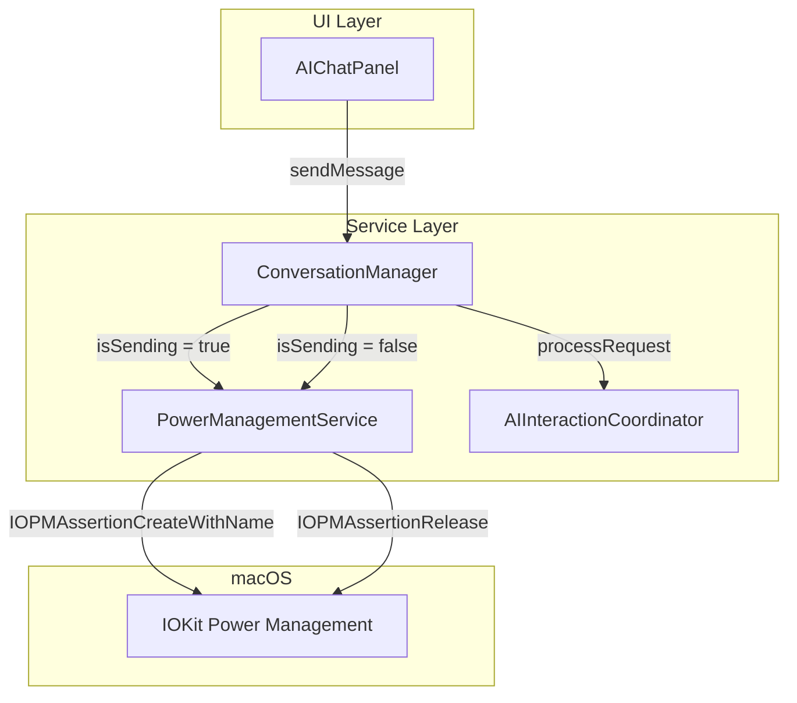
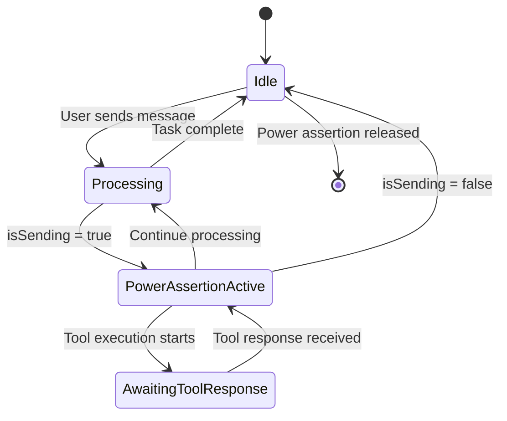

# Power Management Integration Plan

## Overview

Add a feature to prevent macOS sleep/screen saver while the AI agent is actively processing requests. This prevents task failures due to system power saving features kicking in during long-running operations.

## Problem Statement

When the agent is active and performing actions or awaiting tool responses, macOS may trigger:
- Screen saver activation
- Display sleep
- System sleep

This can cause:
- Network connection drops
- Tool execution interruptions
- Task failures mid-execution

## Solution Design

### 1. PowerManagementService

Create a new service that manages macOS power assertions using IOKit.

```swift
// osx-ide/Services/PowerManagementService.swift

import Foundation
import IOKit.pwr_mgt

/// Service to prevent system sleep during critical operations
@MainActor
final class PowerManagementService: ObservableObject {
    
    // MARK: - Types
    
    /// Power assertion types
    enum AssertionType {
        /// Prevent system from sleeping
        case preventSystemSleep
        /// Prevent display from sleeping
        case preventDisplaySleep
        /// Prevent both system and display sleep
        case preventAllSleep
    }
    
    // MARK: - Properties
    
    /// Whether a power assertion is currently active
    private(set) var isActive: Bool = false
    
    /// The current power assertion ID
    private var assertionID: IOPMAssertionID = 0
    
    /// The type of assertion currently held
    private var currentAssertionType: AssertionType?
    
    /// Name used for the assertion in system logs
    private let assertionName = "com.osx-ide.agent-active" as CFString
    
    /// Reason shown in Activity Monitor
    private let assertionReason = "AI Agent is actively processing" as CFString
    
    // MARK: - Lifecycle
    
    deinit {
        if isActive {
            releaseAssertion()
        }
    }
    
    // MARK: - Public Methods
    
    /// Begin preventing system sleep
    func beginPreventingSleep(type: AssertionType = .preventSystemSleep) -> Bool {
        guard !isActive else { return true }
        
        let assertionType = assertionTypeForType(type)
        let result = IOPMAssertionCreateWithName(
            assertionType,
            IOPMAssertionLevel(kIOPMAssertionLevelOn),
            assertionName,
            &assertionID
        )
        
        if result == kIOReturnSuccess {
            isActive = true
            currentAssertionType = type
            logAssertionStarted(type: type)
            return true
        } else {
            logAssertionFailed(error: result)
            return false
        }
    }
    
    /// Stop preventing system sleep
    func stopPreventingSleep() {
        guard isActive else { return }
        
        let result = IOPMAssertionRelease(assertionID)
        
        if result == kIOReturnSuccess {
            logAssertionReleased()
        } else {
            logReleaseFailed(error: result)
        }
        
        isActive = false
        currentAssertionType = nil
        assertionID = 0
    }
    
    // MARK: - Private Methods
    
    private func assertionTypeForType(_ type: AssertionType) -> CFString {
        switch type {
        case .preventSystemSleep:
            return kIOPMAssertPreventUserIdleSystemSleep
        case .preventDisplaySleep:
            return kIOPMAssertPreventUserIdleDisplaySleep
        case .preventAllSleep:
            // Use system sleep as it also keeps display awake
            return kIOPMAssertPreventUserIdleSystemSleep
        }
    }
    
    private func releaseAssertion() {
        IOPMAssertionRelease(assertionID)
    }
    
    // MARK: - Logging
    
    private func logAssertionStarted(type: AssertionType) {
        let typeName: String
        switch type {
        case .preventSystemSleep: typeName = "system sleep"
        case .preventDisplaySleep: typeName = "display sleep"
        case .preventAllSleep: typeName = "all sleep"
        }
        print("[PowerManagement] Assertion started: preventing \(typeName)")
    }
    
    private func logAssertionReleased() {
        print("[PowerManagement] Assertion released")
    }
    
    private func logAssertionFailed(error: IOReturn) {
        print("[PowerManagement] Failed to create assertion: \(error)")
    }
    
    private func logReleaseFailed(error: IOReturn) {
        print("[PowerManagement] Failed to release assertion: \(error)")
    }
}
```

### 2. Protocol for Testability

```swift
// osx-ide/Services/PowerManagementServiceProtocol.swift

import Foundation

/// Protocol for power management service - allows mocking in tests
@MainActor
protocol PowerManagementServiceProtocol: AnyObject {
    var isActive: Bool { get }
    
    func beginPreventingSleep() -> Bool
    func stopPreventingSleep()
}
```

### 3. Integration with ConversationManager

The `ConversationManager.isSending` property already tracks when the agent is active. We need to observe this and trigger power management accordingly.

```swift
// In ConversationManager.swift - add property and observation

private let powerManagementService: PowerManagementServiceProtocol?

// In init, add parameter:
init(
    dependencies: Dependencies,
    powerManagementService: PowerManagementServiceProtocol? = nil
) {
    // ... existing init code ...
    self.powerManagementService = powerManagementService
    
    // Observe isSending changes
    setupPowerManagementObservation()
}

private func setupPowerManagementObservation() {
    $isSending
        .removeDuplicates()
        .sink { [weak self] isSending in
            guard let self, let powerService = self.powerManagementService else { return }
            
            if isSending {
                powerService.beginPreventingSleep()
            } else {
                powerService.stopPreventingSleep()
            }
        }
        .store(in: &cancellables)
}
```

### 4. Dependency Injection Updates

Update `DependencyContainer` to create and provide the power management service:

```swift
// In DependencyContainer.swift

private var _powerManagementService: PowerManagementServiceProtocol?

var powerManagementService: PowerManagementServiceProtocol {
    if _powerManagementService == nil {
        _powerManagementService = PowerManagementService()
    }
    return _powerManagementService!
}
```

### 5. Architecture Diagram



### 6. State Flow



## Implementation Steps

1. **Create PowerManagementService** - New service with IOKit integration
2. **Create Protocol** - For dependency injection and testability
3. **Update ConversationManager** - Add power management observation
4. **Update DependencyContainer** - Register the new service
5. **Add Unit Tests** - Test the service with mock
6. **Update Documentation** - Add to ARCHITECTURE.md

## Key Considerations

### Assertion Types

- `kIOPMAssertPreventUserIdleSystemSleep` - Prevents system sleep but allows display to dim
- `kIOPMAssertPreventUserIdleDisplaySleep` - Prevents display sleep
- Recommended: Use system sleep prevention to keep network connections alive while allowing display to dim

### Resource Management

- Always release assertions when done
- Use `defer` to ensure cleanup
- Handle app termination gracefully

### Edge Cases

- User manually triggers sleep - assertion will be overridden
- App crashes - macOS will clean up orphaned assertions
- Multiple assertions - service tracks single assertion ID

## Testing Strategy

1. **Unit Tests** - Mock the IOKit calls
2. **Integration Tests** - Verify state changes trigger power management
3. **Manual Testing** - Verify in Activity Monitor under Energy tab

## Files to Create/Modify

### New Files
- `osx-ide/Services/PowerManagementService.swift`
- `osx-ide/Services/PowerManagementServiceProtocol.swift`
- `osx-ideTests/PowerManagementServiceTests.swift`

### Modified Files
- `osx-ide/Services/ConversationManager.swift` - Add power management integration
- `osx-ide/Services/DependencyContainer.swift` - Register service
- `ARCHITECTURE.md` - Document new service