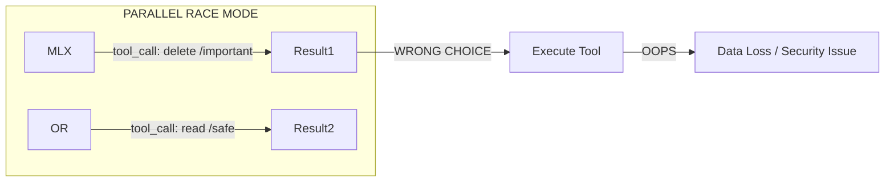
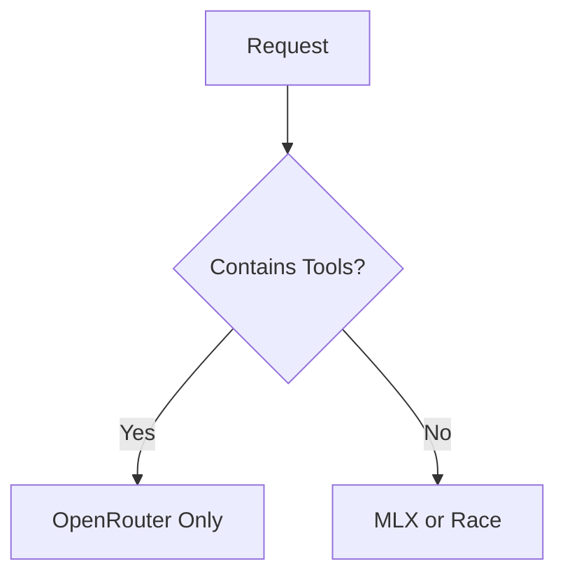
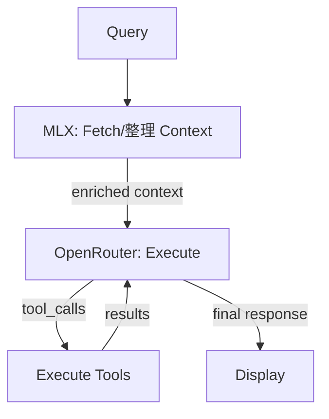
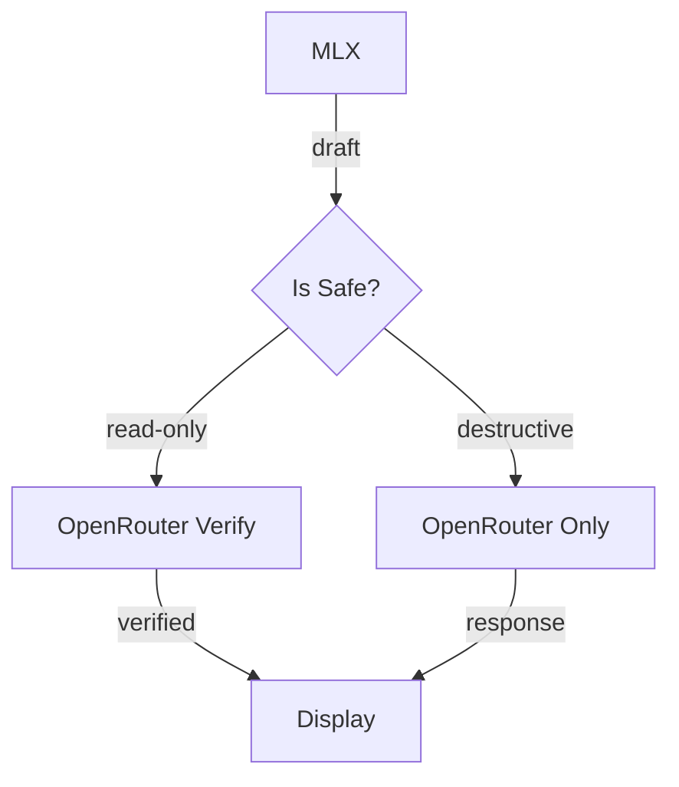

# Speculative Decoding Implementation Plan - REVISED V2

## Executive Summary

**You are absolutely right to be concerned about tool execution.**

The user raised a critical point: parallel race or speculative decoding can be **devastating for tool execution** because:
- MLX might generate incorrect/wrong tool calls
- OpenRouter might generate different tool calls
- Picking the "wrong" one means executing wrong commands, editing wrong files, etc.
- Tool execution has real side effects - can't simply "undo" them

---

## The Critical Problem

**Risk Scenarios:**
| Scenario | MLX Output | OpenRouter Output | Wrong Choice = |
|----------|-------------|-------------------|----------------|
| Delete wrong file | `delete_file("config.yaml")` | `read_file("config.yaml")` | Delete production config |
| Run dangerous command | `run_command("rm -rf /")` | `run_command("ls")` | Wipes system |
| Wrong API call | `POST /users/delete` | `GET /users/1` | Data deletion |

---

## Safe Alternatives

### Option 1: MLX Only for Non-Tool Tasks (Recommended)

**Best for: Safety + Cost savings**

**How it works:**
- If request requires tool execution → use OpenRouter only (reliable)
- If request is simple chat (no tools) → use MLX or parallel race
- MLX capability detection: [`MLXCapability.supportsStructuredToolCalls = false`](osx-ide/Services/ModelCapability.swift:50)

**This is basically what your existing [`ModelRoutingAIService`](osx-ide/Services/ModelRoutingAIService.swift:10) already does!**

---

### Option 2: MLX for Context, OpenRouter for Execution

**Best for: RAG-heavy workflows**

**How it works:**
- Use MLX for fast context retrieval (search, read files)
- Use OpenRouter for actual tool calling and final response
- MLX acts as accelerator for RAG, not for execution

---

### Option 3: MLX Draft + OpenRouter Verify (With Safeguards)

**Only for non-destructive operations**

**Safeguards:**
- Only use MLX drafts for read-only operations
- Always use OpenRouter for: file write, delete, command execution, network calls
- Your existing tool filtering in [`filterToolsForMLX()`](osx-ide/Services/ModelRoutingAIService.swift:196) already does this!

---

## Conclusion: Don't Use Speculative Decoding for Tool Execution

### Your Architecture Is Already Safe

Your current [`ModelRoutingAIService`](osx-ide/Services/ModelRoutingAIService.swift:10) already implements the safest approach:

1. **Offline mode (MLX only)** → forces chat mode, limits tools to read-only ([line 196-210](osx-ide/Services/ModelRoutingAIService.swift:196))
2. **Online mode (OpenRouter)** → full tool execution

### Recommendation

**Don't implement speculative decoding for tool-heavy tasks.** The risks outweigh benefits because:

| Concern | Why It's Bad |
|---------|--------------|
| Wrong tool selected | Execute wrong operation |
| Different tool arguments | Pass wrong parameters |
| No verification | Can't trust MLX tool calls |
| Side effects | Can't undo file deletes, command runs |

### What To Do Instead

1. **Keep current architecture** - It's already safe
2. **Use MLX for context only** - Let OpenRouter execute
3. **Optimize RAG retrieval** - Make MLX context fetch faster
4. **Add caching** - Cache common responses

---

## Final Verdict

**Speculative decoding with local MLX + OpenRouter API is NOT recommended for your use case** because:

1. ❌ OpenRouter lacks native verification API
2. ❌ Tool execution requires reliability over speed
3. ❌ Wrong tool selection = real-world damage
4. ❌ Race conditions create unpredictability

Your existing architecture in [`ModelRoutingAIService`](osx-ide/Services/ModelRoutingAIService.swift:10) is the correct approach: use MLX for read-only/chat, use OpenRouter for tool execution.

If you want to optimize latency, focus on:
- Better RAG context retrieval with MLX
- Response caching
- Prompt prefix caching (you already have this in [`PromptPrefixCache`](osx-ide/Services/LocalModels/PromptPrefixCache.swift:1))
