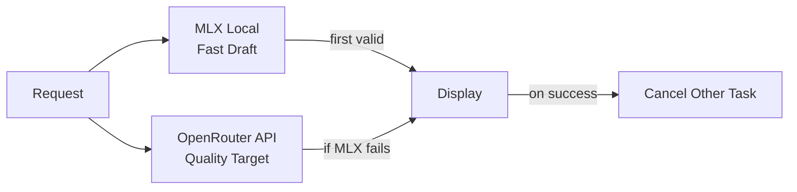
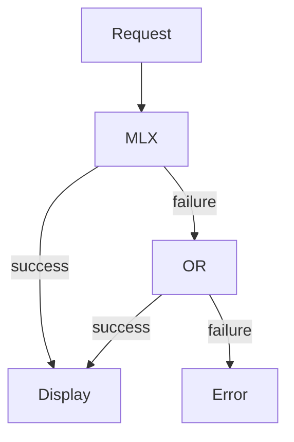
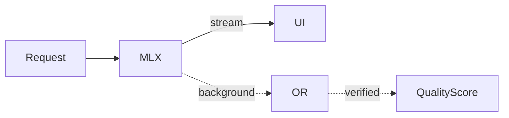
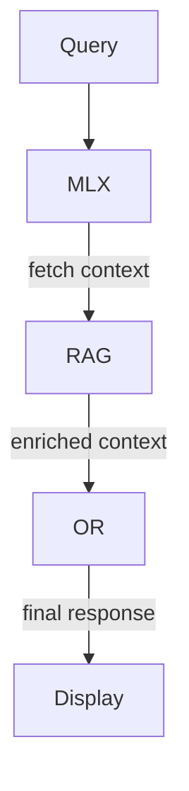

# Speculative Decoding Implementation Plan - REVISED

## Executive Summary

**The original speculative decoding plan has issues. This revised plan addresses them with better alternatives.**

Your concern is valid: OpenRouter API doesn't natively support token verification, which creates:
- Latency jitter from back-and-forth between draft/verify
- UX chaos when tokens conflict
- Complexity without clear benefit

---

## Why Original Plan Is Problematic

| Problem | Impact |
|---------|--------|
| No native verification API | Must embed drafts in prompt = changes model behavior |
| Race conditions | Which tokens to display? MLX or verified? |
| Backtracking complexity | UX confusion when drafts are rejected |
| Network latency | OpenRouter verification adds round-trip, negating MLX speed |

---

## Recommended Alternatives

### Option 1: Parallel Race Mode (Recommended)

**Best for: Fast perceived latency with quality fallback**

**How it works:**
1. Launch MLX and OpenRouter requests simultaneously
2. First valid response wins and is displayed
3. Cancel the slower request
4. If MLX fails or times out, use OpenRouter result

**Benefits:**
- Zero verification conflicts
- Simple implementation
- MLX speed when it works, OpenRouter quality as fallback

---

### Option 2: MLX Primary + OpenRouter Fallback

**Best for: Cost savings + reliability**

**How it works:**
1. Always try MLX first (free, fast)
2. If MLX succeeds → return immediately
3. If MLX fails → fallback to OpenRouter (paid, reliable)

**Benefits:**
- Maximizes MLX usage (free)
- Simple fallback logic
- Your [`ModelRoutingAIService`](osx-ide/Services/ModelRoutingAIService.swift:10) already does this!

---

### Option 3: Background Verification (Deferred)

**Best for: Streaming with post-hoc quality check**

**How it works:**
1. Stream MLX response to user immediately (fast perceived latency)
2. In background, verify with OpenRouter
3. If verification finds issues, show warning indicator

**Benefits:**
- User sees response immediately
- Quality check happens asynchronously
- No perceived latency

---

### Option 4: Context Pre-computation

**Best for: RAG-heavy workflows**

**How it works:**
1. Use MLX to retrieve/relevant RAG context
2. Feed enriched context to OpenRouter for final generation

**Benefits:**
- MLX handles fast retrieval
- OpenRouter generates from better context
- Works well with your existing RAG system

---

## Recommendation

**Use Option 1 (Parallel Race) or enhance Option 2** since your [`ModelRoutingAIService`](osx-ide/Services/ModelRoutingAIService.swift:10) already implements fallback logic.

### Implementation Priority

1. **Enhance ModelRoutingAIService** - Add parallel race capability
2. **Add timeout controls** - Configure MLX timeout before fallback
3. **Add quality scoring** - Track MLX accuracy for optimization
4. **Background verification** - If Option 3 desired

---

## Files to Create/Modify

### For Parallel Race Mode

**New Files:**
- `osx-ide/Services/SpeculativeDecoding/ParallelRaceCoordinator.swift`

**Modified Files:**
- `osx-ide/Services/ModelRoutingAIService.swift` - Add parallel race method
- `osx-ide/Services/AISettingsTab.swift` - Add race mode toggle

---

## Conclusion

The original speculative decoding plan is NOT recommended due to OpenRouter's lack of native verification support. 

**Recommended approach:** Implement parallel race mode or enhance the existing MLX → OpenRouter fallback logic that's already in [`ModelRoutingAIService`](osx-ide/Services/ModelRoutingAIService.swift:10).

Would you like me to create a detailed implementation plan for the Parallel Race approach instead?
