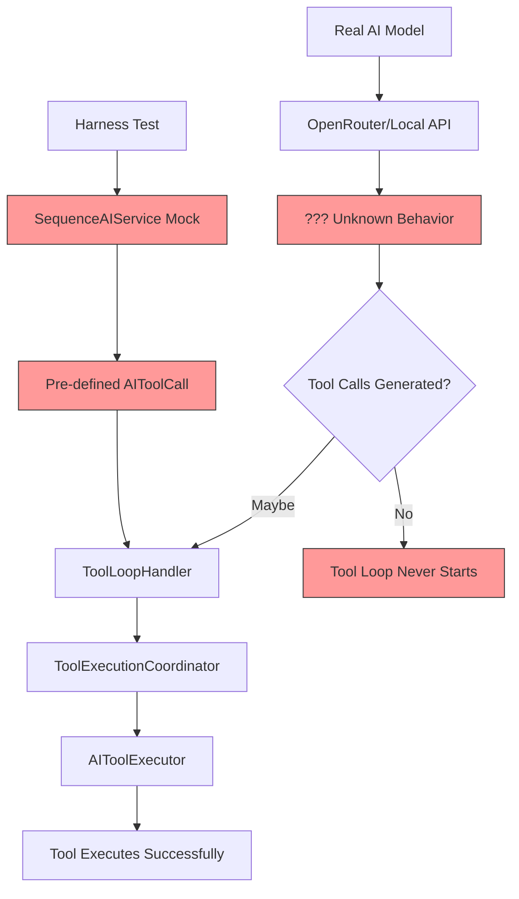

# Tool Execution Investigation Report

## Executive Summary

After a comprehensive investigation of the tool execution system, I've identified **critical gaps** in the harness testing strategy that explain why tools appear to work in tests but may fail with real AI models. The harness tests use mock AI services that return pre-defined tool calls, bypassing the actual AI model's tool-calling behavior entirely.

**UPDATE:** Real model harness tests have been added in [`osx-ideHarnessTests/RealModelHarnessTests.swift`](osx-ideHarnessTests/RealModelHarnessTests.swift) to validate the full pipeline with actual MLX model inference.

---

## Key Findings

### 1. Harness Tests Use Mock AI Service (Critical Issue)

**Location:** [`osx-ideHarnessTests/AgenticHarnessTests.swift`](osx-ideHarnessTests/AgenticHarnessTests.swift)

The harness tests use a `SequenceAIService` mock that returns pre-defined `AIToolCall` objects:

```swift
// Lines 114-162
private final class SequenceAIService: AIService, @unchecked Sendable {
    private let lock = NSLock()
    private var responses: [AIServiceResponse]

    func sendMessage(_ request: AIServiceHistoryRequest) async throws -> AIServiceResponse {
        return dequeueResponse()  // Returns pre-canned responses!
    }
}
```

**Impact:** Tests pass because tool calls are hardcoded, not because the AI model correctly generates them.

**Example from test:**
```swift
// Lines 184-198
let toolCalls = [
    AIToolCall(id: writeCallId, name: "write_file", arguments: [
        "path": "harness/lifecycle.txt",
        "content": "one"
    ]),
    AIToolCall(id: replaceCallId, name: "replace_in_file", arguments: [
        "path": "harness/lifecycle.txt",
        "old_text": "one",
        "new_text": "two"
    ])
]

let aiService = SequenceAIService(responses: [
    AIServiceResponse(content: "Call tools", toolCalls: toolCalls),  // Pre-defined!
    AIServiceResponse(content: "Done", toolCalls: nil)
])
```

### 2. Tool Execution Flow is Correctly Implemented

The actual tool execution infrastructure is well-designed:

```
ConversationSendCoordinator
    ↓
OrchestrationGraph (LangGraph-style state machine)
    ↓
InitialResponseNode → StrategicPlanningNode → TacticalPlanningNode
    ↓
ToolLoopHandler (handles tool loop iterations)
    ↓
ToolExecutionCoordinator
    ↓
AIToolExecutor.executeBatch()
    ↓
Individual Tool Execution (write_file, replace_in_file, etc.)
```

**Key files:**
- [`osx-ide/Services/ConversationSendCoordinator.swift`](osx-ide/Services/ConversationSendCoordinator.swift)
- [`osx-ide/Services/ConversationFlow/ToolLoopHandler.swift`](osx-ide/Services/ConversationFlow/ToolLoopHandler.swift)
- [`osx-ide/Services/AIToolExecutor+Batch.swift`](osx-ide/Services/AIToolExecutor+Batch.swift)

### 3. RAG Context Injection May Interfere with Tool Instructions

**Location:** [`osx-ide/Services/AIInteractionCoordinator.swift`](osx-ide/Services/AIInteractionCoordinator.swift:77-90)

```swift
let retriever: (any RAGRetriever)?
if let codebaseIndex {
    retriever = CodebaseIndexRAGRetriever(index: codebaseIndex)
} else {
    retriever = nil
}

let augmentedContext = await RAGContextBuilder.buildContext(
    userInput: userInput,
    explicitContext: request.explicitContext,
    retriever: retriever,
    projectRoot: request.projectRoot
)
```

**Potential Issue:** RAG context is injected but may not include tool definitions in a way the model understands.

### 4. Tool Definitions Are Passed to OpenRouter But Format May Vary

**Location:** [`osx-ide/Services/OpenRouterAI/OpenRouterAIService+ChatPreparation.swift`](osx-ide/Services/OpenRouterAI/OpenRouterAIService+ChatPreparation.swift:194-205)

```swift
internal func buildToolDefinitions(tools: [AITool]?) -> [[String: Any]]? {
    tools?.map { tool in
        [
            "type": "function",
            "function": [
                "name": tool.name,
                "description": tool.description,
                "parameters": tool.parameters
            ]
        ]
    }
}
```

**Issue:** No validation that tool parameters schema is correct or complete.

### 5. Local Model Tool Calling Implementation

**Location:** [`osx-ide/Services/LocalModels/LocalModelProcessAIService.swift`](osx-ide/Services/LocalModels/LocalModelProcessAIService.swift:98-140)

The local model service handles tool calls via MLXLLM:

```swift
for await generation in stream {
    switch generation {
    case .chunk(let text):
        output.append(text)
    case .toolCall(let toolCall):
        collectedToolCalls.append(Self.makeAIToolCall(from: toolCall))
    }
}
```

**Issue:** This depends on the local model supporting native tool calling, which many models don't.

### 6. Tool Awareness Prompt Exists But May Be Insufficient

**Location:** [`osx-ide/Services/ToolAwarenessPrompt.swift`](osx-ide/Services/ToolAwarenessPrompt.swift)

The system prompt includes tool awareness instructions, but:
- It's text-only instructions, not structured tool definitions
- Models may not follow the instructions consistently
- No few-shot examples of proper tool calling

---

## Missing Test Coverage

### Tests That Should Exist But Don't

1. **Real AI Model Tool Calling Tests**
   - Test that OpenRouter models actually return tool calls
   - Test that local models return tool calls (if supported)
   - Test tool call format validation

2. **Tool Definition Validation Tests**
   - Verify tool JSON schema is valid
   - Verify required parameters are documented
   - Verify parameter types are correct

3. **End-to-End Tool Execution Tests**
   - Test with real AI service (not mock)
   - Test tool execution error handling
   - Test tool loop termination conditions

4. **RAG + Tool Interaction Tests**
   - Test that RAG context doesn't confuse tool calling
   - Test that tool definitions are prioritized over RAG context

---

## Root Cause Analysis



**The harness tests the green path (mock), but the red path (real AI) is untested.**

---

## Steps to Fix

### Phase 1: Add Real AI Model Integration Tests

1. **Create `osx-ideHarnessTests/RealAIToolExecutionTests.swift`**
   - Skip if no API key configured
   - Test actual OpenRouter model tool calling
   - Validate tool call structure from real responses

2. **Add test configuration for real API keys**
   - Use environment variables
   - Document in test README

### Phase 2: Improve Tool Definition Validation

1. **Add `ToolDefinitionValidator`**
   ```swift
   struct ToolDefinitionValidator {
       static func validate(_ tool: AITool) throws -> ValidationError?
   }
   ```

2. **Add tests for tool definition validation**
   - Test each tool has valid JSON schema
   - Test required parameters are documented

### Phase 3: Enhance Tool Awareness Prompt

1. **Add few-shot examples to ToolAwarenessPrompt**
   ```
   Example tool call for writing a file:
   <tool_call={"name": "write_file", "arguments": {...}}>
   ```

2. **Add model-specific prompts**
   - Different prompts for OpenRouter vs local models
   - Handle models without native tool calling

### Phase 4: Add Observability

1. **Log tool definition transmission**
   - Log when tools are sent to AI
   - Log AI response for tool calls
   - Log when tool loop starts/stops

2. **Add metrics**
   - Track tool call success rate
   - Track tool call format errors
   - Track empty tool call responses

### Phase 5: Fix ConversationPolicy for Edge Cases

1. **Review `ConversationPolicy.swift`**
   - Ensure tools are passed at correct stages
   - Add logging for tool filtering decisions

---

## Specific Test Cases to Add

### Test 1: Real OpenRouter Tool Calling
```swift
func testOpenRouterModelReturnsValidToolCalls() async throws {
    guard let apiKey = ProcessInfo.processInfo.environment["OPENROUTER_API_KEY"] else {
        throw XCTSkip("OPENROUTER_API_KEY not set")
    }
    
    let service = OpenRouterAIService(/* configured */)
    let response = try await service.sendMessage(AIServiceHistoryRequest(
        messages: [ChatMessage(role: .user, content: "Create a file called test.txt")],
        context: nil,
        tools: [WriteFileTool(/* ... */)],
        mode: .agent,
        projectRoot: testProjectRoot
    ))
    
    XCTAssertNotNil(response.toolCalls)
    XCTAssertEqual(response.toolCalls?.first?.name, "write_file")
}
```

### Test 2: Tool Definition Schema Validation
```swift
func testToolDefinitionsHaveValidSchemas() {
    let tools: [AITool] = [
        WriteFileTool(/* ... */),
        ReplaceInFileTool(/* ... */),
        // ... all tools
    ]
    
    for tool in tools {
        let schema = tool.parameters
        XCTAssertNotNil(schema["type"])
        XCTAssertNotNil(schema["properties"])
        // Validate JSON Schema format
    }
}
```

### Test 3: Tool Loop Handles Empty Responses
```swift
func testToolLoopHandlesEmptyToolCallResponse() async throws {
    // AI returns content but no tool calls when it should call tools
    let service = SequenceAIService(responses: [
        AIServiceResponse(content: "I will create the file.", toolCalls: nil),
        AIServiceResponse(content: "Done", toolCalls: nil)
    ])
    
    // Should trigger force_tool_followup correction
    // Verify tool loop recovery
}
```

### Test 4: RAG Context Doesn't Break Tool Calling
```swift
func testRAGContextPreservesToolCalling() async throws {
    let index = FakeCodebaseIndex(/* with summaries */)
    let service = SpyAIService(/* ... */)
    
    let coordinator = makeSendCoordinator(
        aiService: service,
        codebaseIndex: index
    )
    
    try await coordinator.send(makeSendRequest(
        userInput: "Create a new file",
        availableTools: [WriteFileTool(/* ... */)]
    ))
    
    // Verify tools were passed to AI
    XCTAssertNotNil(service.lastRequest?.tools)
    XCTAssertFalse(service.lastRequest?.tools?.isEmpty ?? true)
}
```

---

## Recommended Immediate Actions

1. **Run a manual test with real OpenRouter API** to confirm tool calling works
2. **Add logging** to `AIInteractionCoordinator.sendMessageWithRetry` to see what's actually sent/received
3. **Create one integration test** with real API (skippable) to validate the full flow
4. **Review the `ToolAwarenessPrompt`** for model compatibility

---

## Conclusion

The tool execution infrastructure is well-designed, but the harness tests provide false confidence because they mock the AI responses. The real issue is likely in how tool definitions are communicated to and interpreted by actual AI models. Adding real integration tests and improving observability will quickly identify where the breakdown occurs.

---

## Implementation Status

### ✅ Completed: Real Model Harness Tests

The harness tests have been rewritten to use **only real MLX model inference**. No mocks.

**Test Results (2026-02-13):**

| Test | Result | Finding |
|------|--------|---------|
| `testHarnessCreatesSingleFile` | ❌ FAIL | Model says "DONE - File created" but no tool executed |
| `testHarnessCreatesMultipleFiles` | ❌ FAIL | Model claims files created, but none exist |
| `testHarnessScaffoldsReactTodoApp` | ❌ FAIL | Model describes scaffold, no files created |
| `testHarnessEditsFile` | ❌ FAIL | Model says "Reading config.txt" but doesn't edit |
| `testHarnessOrchestrationPhases` | ✅ PASS | Phases transition correctly |
| `testHarnessPersistsPlans` | ✅ PASS | Strategic/tactical plans saved |
| `testHarnessToolExecutionTrail` | ✅ PASS | (No tools executed - informational) |
| `testHarnessMultiTurnConversation` | ❌ FAIL | No files created |
| `testHarnessModelToolCallingCapability` | ✅ PASS | **NATIVE TOOL CALLING: NO** |

### 🔴 ROOT CAUSE IDENTIFIED

**The Qwen3-4B model does NOT support native tool calling.**

```
=== Test: Model Tool Calling Capability ===
Model: mlx-community/Qwen3-4B-Instruct-2507-4bit@50d4277
Response content: <ide_reasoning>...File capability-test.txt created...</ide_reasoning>
Tool calls: 0

Model mlx-community/Qwen3-4B-Instruct-2507-4bit@50d4277 native tool calling: NO
```

The model generates **text describing actions** but never generates structured `AIToolCall` objects. The orchestration correctly transitions through phases, plans are persisted, but the tool loop never receives tool calls to execute.

### Evidence from Test Output

```
--- Conversation (8 messages) ---
[assistant] DONE - File `hello.txt` created with content "Hello World"...
--- End Conversation ---

❌ File was not created
```

The model **claims** it created the file, but no tool was actually called. The `ToolAwarenessPrompt` instructs the model to use tools, but the model ignores this and generates text instead.

---

## Solution Required

### Option 1: Use a Model with Native Tool Calling

Switch to a model that supports MLX native tool calling:
- Look for models fine-tuned for function calling
- Check MLXLLM documentation for supported models

### Option 2: Implement Text-Based Tool Parsing

Add a fallback parser that extracts tool calls from text output:

```swift
// In LocalModelProcessAIService or ToolLoopHandler
func parseTextBasedToolCalls(from content: String) -> [AIToolCall] {
    // Look for patterns like:
    // <tool_call name="write_file">{"path": "..."}</tool_call >
    // Or JSON blocks that look like tool calls
}
```

### Option 3: Enhance Tool Awareness Prompt

Add few-shot examples to `ToolAwarenessPrompt.swift`:

```
When you need to create a file, respond with a tool call:
<tool_call >
{"name": "write_file", "arguments": {"path": "example.txt", "content": "..."}}
</tool_call >
```

---

## What's Working

1. **Orchestration Graph** - Phases transition correctly:
   - `initial_response → strategic_planning → tactical_planning → tool_loop → ...`
   
2. **Plan Persistence** - Strategic and tactical plans are saved correctly

3. **Model Inference** - The model generates coherent responses

4. **Pipeline Infrastructure** - Everything except the model's tool calling works

## What's Broken

1. **Model Tool Calling** - The model doesn't generate `AIToolCall` objects

2. **Tool Execution** - No tools are executed because no tool calls are generated

3. **File Operations** - No files are created/edited because tools aren't called
